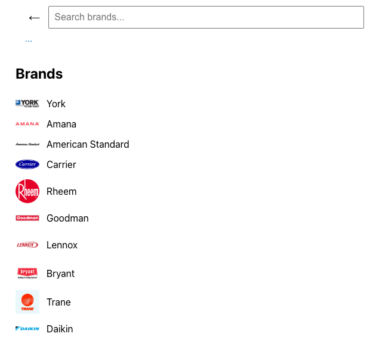
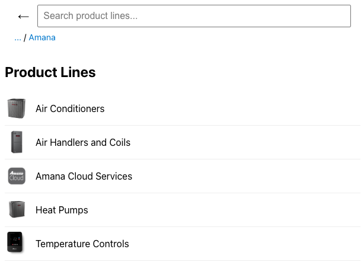
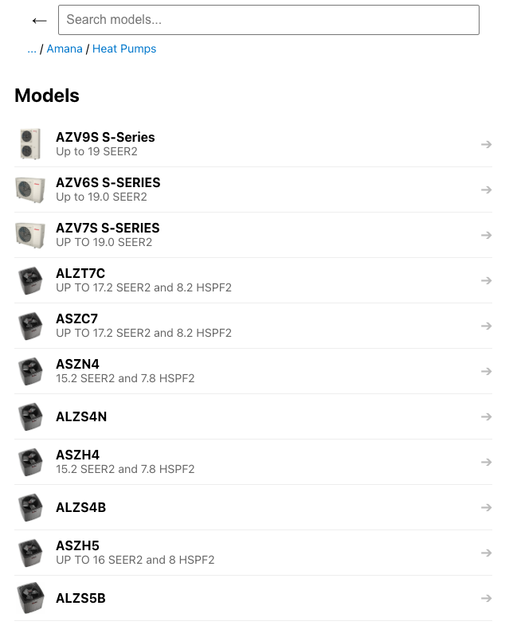

# HVAC Product Catalog Interface

## Data Sources & Structure

All HVAC data in this project was collected by scraping official manufacturer websites to ensure accuracy and freshness.

### Source Websites

Data was gathered from the following brand websites:

Carrier: "https://www.carrier.com/residential/en/us/products/heating-cooling/"

Trane: "https://www.trane.com/residential/en/products/"

Lennox: "https://www.lennox.com/residential/products/heating-cooling"

Rheem: "https://www.rheem.com/products/residential/heating-and-cooling/"

Goodman: "https://www.goodmanmfg.com/products/residential-products#HeatingandCooling"

Daikin:"https://daikincomfort.com/products/heating-cooling/whole-home-systems"

York: "https://www.york.com"

Amana: "https://www.amana-hac.com/products"

American Standard: "https://www.americanstandardair.com/products/#heating-cooling"

Bryant: "https://www.bryant.com/en/us/products/"

### Data Structure

Each brand's data was normalized into a consistent tabular format with the following columns:

```bash 
product_line_name, product_line_image, model_name, model_image, efficiency
```

### Processing

CSVs were grouped by product_line_name and models using pandas.
Missing fields (NaN) were cleaned and replaced with blank strings.
Final output was converted into a unified JSON file (hvacData.js) structured by:
brand → productLines → models
This makes the data easy to use and render in the frontend application.


## ⚙️ Setup Instructions
Follow the steps below to set up and run the HVAC catalog application locally.

### Prerequisites

Make sure you have the following installed:

- Node.js (v14+ recommended)
- Python 3.7+
- pip for installing Python packages
- npm (comes with Node.js)

1. Clone the Repository

```bash 
git clone https://github.com/your-username/hvac-catalog.git 
cd hvac-catalog
```

2.  Install Frontend Dependencies

```bash 
npm install
```

4. Run the App

```bash 
npm start 
```

## Usage and Features

Once the application is running, users can explore HVAC systems through a clean, multi-level interface:

### Navigation Flow

- Home Page: Displays a list of HVAC brands, each with a logo.

- Brand Page: Shows available product lines (e.g. Air Conditioners, Heat Pumps).

- Product Line Page: Lists all models under the selected product line.

- Model Page: Displays product image, model name, and efficiency (e.g., SEER2).

- Model Detail Page (in progress): Placeholder for future specs, manuals, and advanced details.


### Search Functionality

- A search bar is available on each page (brands, lines, models).

- Case-insensitive: Typing `york`, `YORK`, or `YoRk` works the same.

- Flexible input: You don't need to type from the beginning — searching `ork` will still find `York`.

- Filtering updates results in real time as you type.


### Back Navigation

- A clickable breadcrumb path is shown under the search bar.

- Users can quickly go back to the previous level (brand or product line) by clicking the appropriate segment.


### UI Preview

Screenshots are included below to illustrate:

- The brand list view


- Product line listing


- Model search results with images and efficiency


## Challenges & Solutions

One of the main challenges in building this application was gathering consistent HVAC product data across different brands. Each manufacturer structures their website differently, making it difficult to apply a single scraping template. In some cases, model information and efficiency specifications like SEER2 or AFUE were readily available, but in others, they were buried within product detail pages or embedded in long text descriptions. To solve this, I created a flexible scraping pipeline that could be adapted per brand while maintaining a consistent output format. This approach ensures future scalability and allows for efficient updates and modifications.


